# Juego de Cálculo Mental

Trabajo práctico individual desarrollado para la materia **Desarrollo de Aplicaciones I**.

La aplicación fue desarrollada con **React Native**, utilizando **Expo** como entorno de desarrollo. El objetivo principal es implementar un juego de cálculo mental donde el usuario debe resolver operaciones matemáticas bajo presión de tiempo, registrando puntaje, precisión, velocidad de respuesta, historial y mejores puntajes.

---

## Objetivo de la aplicación

El objetivo de la aplicación es evaluar la capacidad del usuario para resolver operaciones matemáticas en un tiempo determinado.

Durante cada partida, la aplicación genera operaciones aleatorias según la dificultad seleccionada. El usuario debe responder correctamente antes de que se agote el tiempo. Al finalizar la ronda, se muestran estadísticas del desempeño obtenido.

---

## Tecnologías utilizadas

- React Native
- Expo
- Expo Router
- TypeScript
- NativeWind
- AsyncStorage
- Expo Vector Icons

---

## Instalación y ejecución

Instalar dependencias:

```bash
pnpm install
```

Ejecutar en entorno web:
```bash
pnpm web
```

Ejecutar con Expo:
```bash
pnpm exec expo start
```

---

## Funcionalidades implementadas
La aplicación incluye las siguientes funcionalidades:
- SplashScreen inicial.
- Pantalla principal con acceso a nueva partida e historial.
- Configuración de dificultad.
- Configuración del modo de juego.
- Generación aleatoria de operaciones matemáticas. 
- Temporizador por pregunta según dificultad.
- Registro derespuestas correctas, incorrectas y sin responder.
- Cálculo de puntaje según precisión y velocidad.
- Visualización de estadísticas finales.
- Registro de historialde partidas.
- Registro de mejorpuntaje histórico.
- Persistencia local utilizando AsyncStorage.
- Posibilidad de reiniciar la partida actual.
- Limpieza del historial guardado.

---

## Nivelesde dificultad
La aplicación permite seleccionar tres niveles de dificultad:
| Dificultad | Operaciones                                           | Tiempo por operación |
| ---------- | ----------------------------------------------------- | -------------------- |
| Fácil      | Sumas y restas simples                                | Mayor tiempo         |
| Medio      | Sumas, restas y multiplicaciones                      | Tiempo intermedio    |
| Difícil    | Operaciones más complejas, incluyendo división exacta | Menor tiempo         |

La dificultad afecta tanto la complejidad de las operaciones como el tiempo disponible para responder.

---

## Modos de Juego
### Modo clásico
El usuario debe ingresar manualmente el resultado de la operación.

Ejemplo:
`8 + 5 = ?`

---
### Modo verdadero / falso
La aplicación muestra una operación conun resultado propuesto. El usuario debe indicar si la afirmaciónes verdadera o falsa.

--- 
### Modo múltiple choice
La aplicación muestra una operación y cuatro posibles respuestas. El usuario debe seleccionar la opción correcta.

--- 
### Modo contrarreloj
El usuario responde operaciones de forma continua hasta fallar o hasta uqe se agote el tiempo total asignado.

---
## Sistema de puntaje
El puntaje se calcula según la respuesta del usuario y el tiempo utilizado:
| Situación                            | Puntaje |
| ------------------------------------ | ------: |
| Respuesta correcta rápida            |    +100 |
| Respuesta correcta dentro del tiempo |     +70 |
| Respuesta incorrecta                 |     -30 |
| Sin respuesta                        |     -50 |

Una respuesta seconsidera rápida cuando se responde antes de utilizar el 75% del tiempo disponible.

---
## Estadísticas finales
Al finalizar una partida, la aplicación muestra:
- Puntaje total.
- Cantidad de respuestascorrectas.
- Cantidad de respuestas incorrectas.
- Cantidad de preguntas sin responder.
- Precisión.
- Tiempo promedio de respuesta.
- Modo de juego utilizado.
- Dificultad seleccionada.
- Mejor puntaje histórico.

---

## Persistencia local
La aplicación utiliza **AsyncStorage** para guardar localmente el historial de partidas.

Cada resultado guardado incluye:
- Fecha de la partida.
- Puntaje obtenido.
- Dificultad.
- Modo de juego.
- Cantidad de preguntas jugadas.
- Respuestas correctas.
- Respuestas incorrectas.
- Preguntas sin responder.
- Precisión
- Tiempo promedio.

La persistencia es exclusivamente local y no requiere conexión a internet.

---
## Estructura del proyecto
```plain
src/
  app/
    _layout.tsx
    index.tsx
    home.tsx
    config.tsx
    game.tsx
    result.tsx
    history.tsx

  components/
    AppButton.tsx
    AppCard.tsx
    AppHeader.tsx
    FooterBar.tsx
    TimerBar.tsx
    StatBox.tsx
    GameHeader.tsx
    GameProgressCard.tsx
    QuestionCard.tsx
    AnswerSection.tsx
    GameStatsCard.tsx

  constants/
    gameConfig.ts

  hooks/
    useGame.ts

  logic/
    buildQuestion.ts
    calculateScore.ts
    createGameResult.ts
    generateChoices.ts
    generateOperation.ts

  storage/
    gameStorage.ts

  types/
    game.ts
```

---
## Decisiones de diseño
Se decidió dividir la aplicación en pantallas simples y componentes reutilizables para facilitar el mantenimientodel código.

La pantallade configuración se implementó como un flujo guiadodetres pasos:
1. Selección de dificultad.
2. Selección de modo de juego.
3. Selección de cantidad de preguntas.

La lógica principal de la partida se separó en uncustom hook llamado `useGame.ts`, encargado de manejar el estado del juego, el temporizador, la validación de respuestas, el puntaje y la finalización de la partida.

Las funciones puras relacionadas con la generación de operaciones, opciones de respuesta y cálculo de resultados seubicaron en la carpeta `logic`.

La persistencia local se centralizó en `gameStorage.ts`, utilizando AsyncStorage para guardar y recuperar el historial de partidas.

También se implementaron componentes reutilizables como botones, tarjetas, encabezados, barra de navegación inferior, barra de tiempo y tarjetas de estadísticas.

---
## Capturas de Pantalla
### Splash Screen
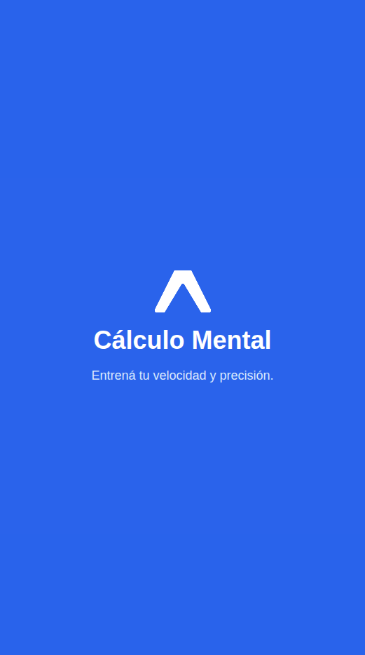

### Pantalla principal
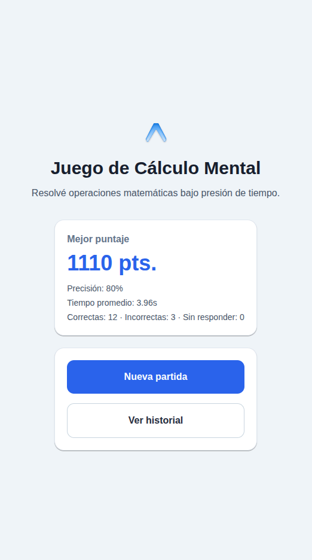

### Configuración | Dificultad
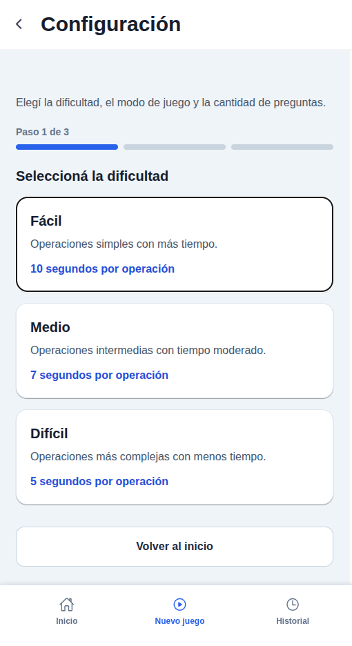

### Configuración | Modo de Juego
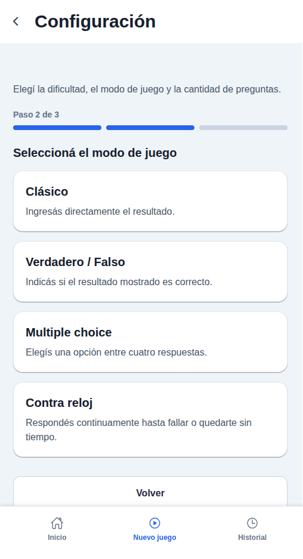

### Configuración | Cantidad de Preguntas
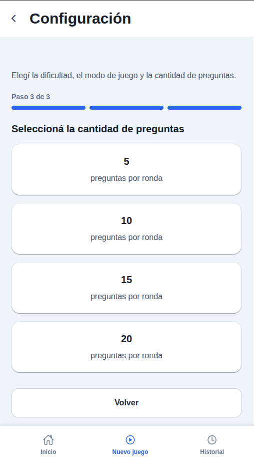

### Juego | Modo Clásico
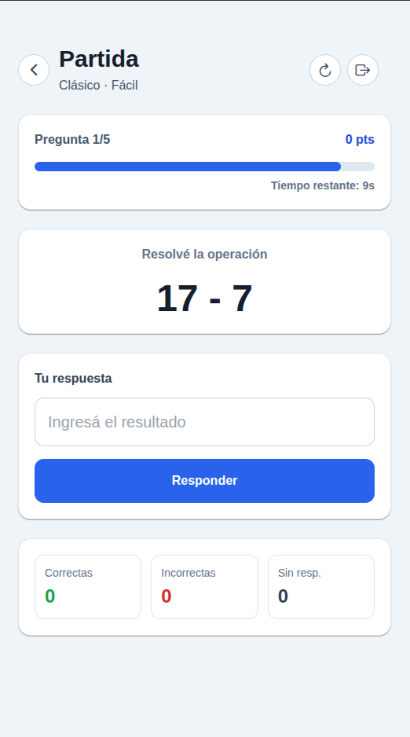

### Juego | Verdadero o Falso
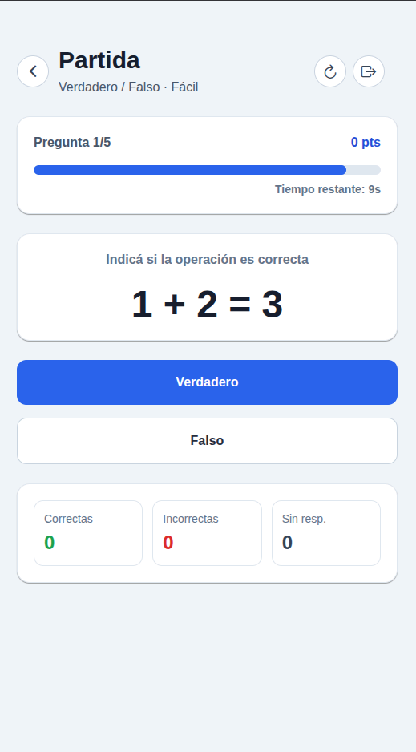

### Juego | Multiple Choice
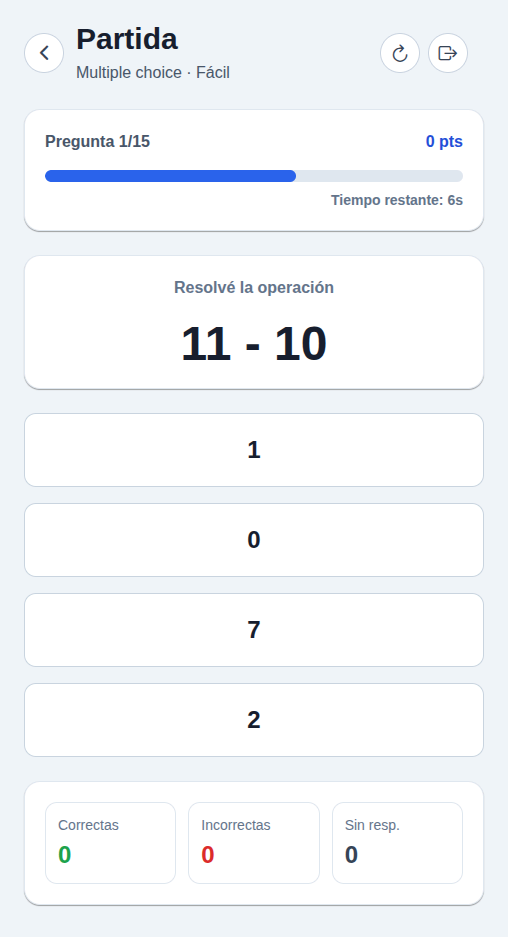

### Juego | Contrarreloj
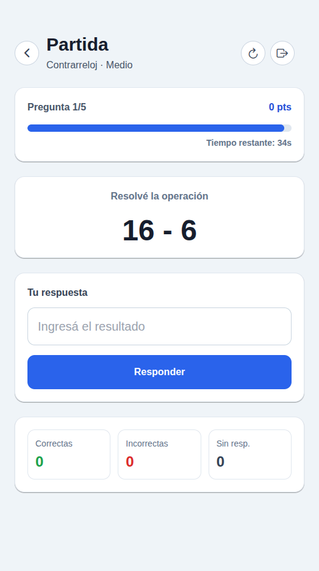

### Juego | Reiniciar Partida


### Resultado Final
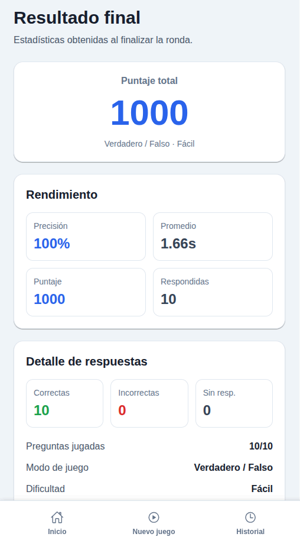

### Historial
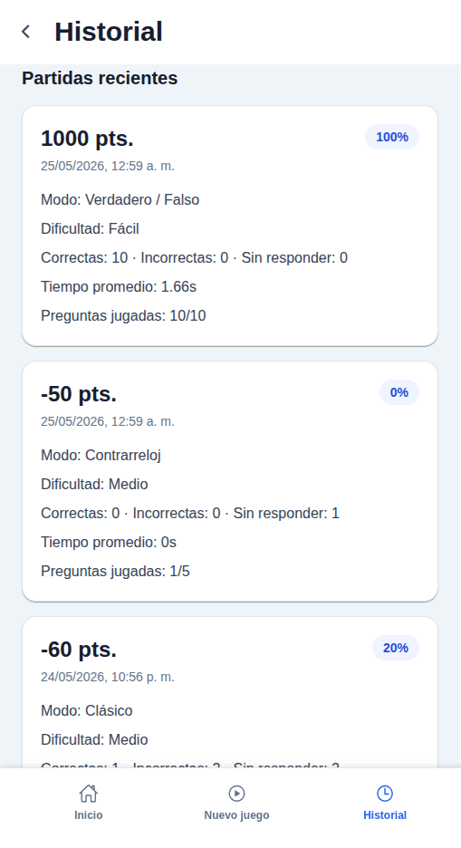

### Historial | Mejor Resultado
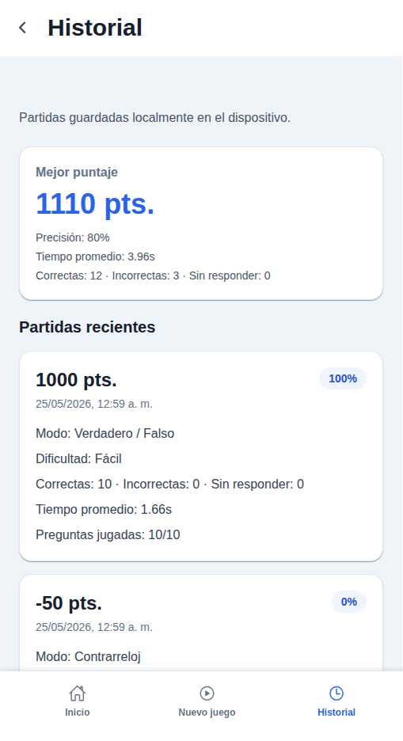

### Historial | Limpiar historial
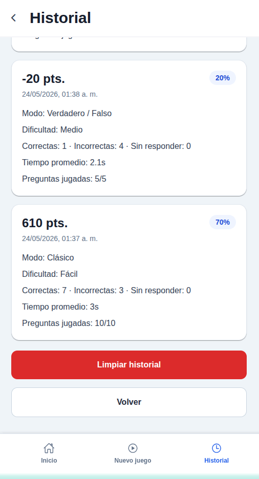